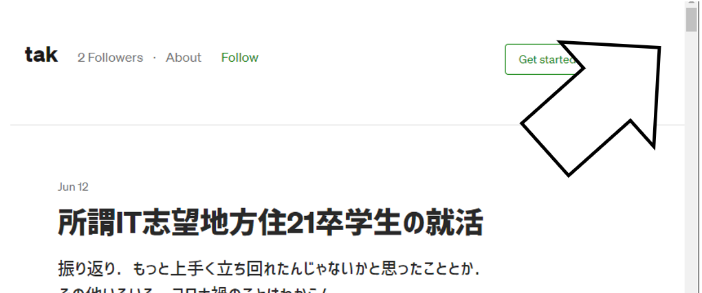
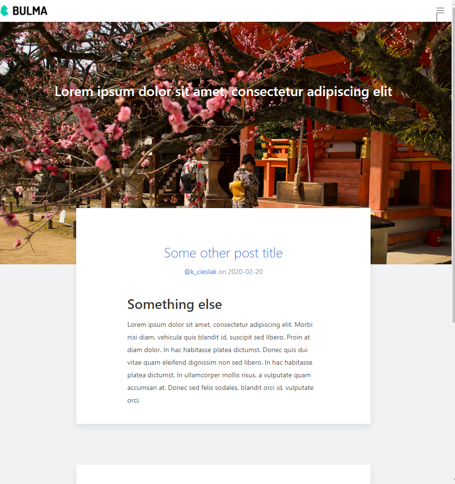

[広島大学ITエンジニア Advent Calendar 2020](https://adventar.org/calendars/5209) 二日目の記事になります．
[@kaito](https://twitter.com/kaito_tateyama)の[[ansible+goss] PCの初期セットアップで学ぶサーバー設定テスト](https://www.blog.uta8a.net/posts/2020-11-30-dotfiles/)に続きます！

<!--more-->

## 概要 

巷で良く耳にする**SSG**(Static Site Generator)とホスティングサービスを使って，
今表示されているブログサイトを作成します．記事を閲覧できる状態をゴールとします．
作りこむのは後．

## 経緯

ブログのようなモノを書くにあたって，記事以外に労力を割きたくないのもあって，これまでは[medium](https://t.co/DDY4wTvLCv?amp=1)を使っていました．

基本的に満足していたんですが，最近の更新でロゴやUIが変わって残念な感じになってしまいました(例えば，いきなり記事を全部表示しようとするとか)．

時期を同じくして，技術ブログサービス[Qrunch](https://qrunch.net/)が終了したのもあって，運営に振り回されないブログ基盤欲が大きくなり，カレンダーのネタにもなるのでブログを構築することにしました．

## コード

今回使用したコードは以下に掲載しています．

## 使う・使ったモノ

### Googleドメイン

必須ではないですが，せっかくの機会なので独自ドメインを使おうと考えました．
**taktak.net**や**taktak.jp**あたりのドメインを取ろうと思いましたが，先約がいたので**taktak.dev**を取得することに．

**dev**ドメインを取り扱っていて，評判もいい[Google Domains](https://domains.google)でドメインを取得しました．

### Fornax

有名どころだと[Hugo](https://github.com/gohugoio/hugo)や[Gatsby](https://github.com/gatsbyjs/gatsby), [Jekyll](https://github.com/jekyll/jekyll)がありますが，今回SSGにはVSCodeにおけるF#開発環境の事実上の標準となっている[ionide](https://github.com/ionide/ionide-vscode-fsharp)を開発しているionideの[Fornax](https://github.com/ionide/Fornax)を使います．

選定理由としてはF#が好きであることはもちろんですが，[Waypoint](https://github.com/ionide/Waypoint)のようなテンプレートを見て，今後F#を使って何かを作る際に[Paket](https://github.com/fsprojects/Paket)や[FAKE](https://github.com/fsharp/FAKE), [Expecto](https://github.com/haf/expecto)のようなツール群と組み合わせて使うことを容易に想像できたため，早めに慣れておこうと思ったからです．

### Vercel

ホスティングサービスは利便性を考え，[Netlify](https://www.netlify.com/)か[Vercel](https://vercel.com/)の二択でしたが，日本にCDNがあるVercelを選択しました．

### Vercel Action

Vercel側でビルドを行うのがおそらく主流ですが，FornaxはサポートされていないのでGitHub Actions側でビルドを行い[Vercal Action](https://github.com/marketplace/actions/vercel-action)を使ってデプロイします．
別途手間がかかりますが，[無料枠の制限](https://vercel.com/docs/platform/limits#rate-limits)から解放されるのでVercel側でビルドがサポートされている場合でも検討する価値はあると思います．
ブログ開設時の設定としては以下のような感じです．

## その他

投稿時点でサイトの作りこみは行っていないです．
`fornax new`を行った直後の状態が以下のような感じなのでほとんど
変わっていないのが分かると思います．

僕が神社好きというわけでも無く，Fornaxの標準のテンプレートに[北野天満宮](https://www.kitanotenmangu.or.jp/)が使われているのです．

今回は使用していませんがF#トランスパイラの[Fable](https://github.com/fable-compiler/fable)の最新バージョンの開発コード?は[Nagareyama(流山)](https://fable.io/blog/Announcing-Nagareyama-3.html)になっています．こっちに関しては
コアの開発者の方が千葉に住んでいるらしくこういった名前になったっぽいです．([Nagareyama: a new Fable, faster, more powerful and easier to use](https://skillsmatter.com/skillscasts/14876-nagarema-a-new-fable-faster-more-powerful-and-easier-to-use))

日本ではF#があまり使われていないなんて話を良く耳にしますが，最先端のF#に日本と接点があるのが面白いですね．
