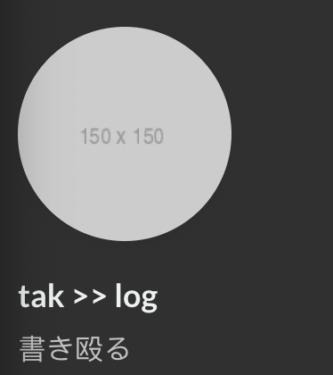
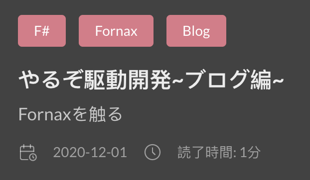

[Nix Advent Calendar 2021](https://qiita.com/advent-calendar/2021/nix)の12日目の記事になります。

## 概要

最近、Nixにはまっているのでブログ環境にもその思想を導入していきたいと思います。
今回のアドカレ駆動開発によって、環境の構築からビルドまでNixの恩恵を受けられるようになりました。

僕がNixを使う理由については
[**Nixを使うと何が嬉しいのか**](https://scrapbox.io/mrsekut-p/Nix%E3%82%92%E4%BD%BF%E3%81%86%E3%81%A8%E4%BD%95%E3%81%8C%E5%AC%89%E3%81%97%E3%81%84%E3%81%AE%E3%81%8B)
という4日目の記事に書かれているのでそちらを参照ください。

---

## コード

- ブログ本体



- Nixと連携する[direnv](https://github.com/direnv/direnv)などが入った環境



### ざっくり解説

今回SSGには[Hugo](https://gohugo.io/)を利用します。

大まかな構成は[Directory Structure](https://gohugo.io/getting-started/directory-structure/)に従います。
`hugo`本体や`theme`などをNixで管理します。

```
.
├── archetypes
├── config.toml
├── content
├── data
├── layouts
├── static
└── themes
```

### 環境の構築とビルドの様子

実際にブログの環境を構築し、`hugo serve`を実行したり、`nix build`を実行している様子です。
Nixによるimpureな(直和的な?)環境では丹精込めて育てた`vim`なども利用可能です。



(asciinema埋め込みもそのうちやりたい。)

### 詰まった箇所

Nixを利用することで強力な支援を得ることができますが、Nixを使う上で必要な工夫がいくつかあったので共有します。

#### HugoのJavaScript BuildingでWriteが発生する

hugo内で`js.Build`を利用すると`assets`へ`jsconfig.json`の書き込み要求が発生します。
`assets`はNixで管理されたテーマ配下、つまりimmutableな領域ですのでビルドが失敗してしまいます。

解決方法としては`v0.78.0`で追加された`noJSConfigInAssets`を利用します。([configration](https://gohugo.io/getting-started/configuration/))

>> Turn off writing a jsconfig.json into your /assets folder with mapping of imports from running js.Build. This file is intended to help with intellisense/navigation inside code editors such as VS Code. Note that if you do not use js.Build, no file will be written.

説明の通りhugoのconfigファイルで設定を有効にしますと書き込みが発生しなくなりビルドが通るようになります。

#### assetsに自分のファイルを置けない

多くのhugoテーマで`assets`から画像を読み込む実装がなされていると思います。

```html
<!-- ... 略 -->
{{ $avatar := resources.Get (.src) }}
```



通常は`assets`にファイルを置くなどすることで対応可能ですが、
先に述べたようにNixで管理する以上`assets`はimmutableなので、それはできません。

解決方法としてはhugoの`mounts`を利用します。
`mounts`は文字通りマウントを行うことができます。
([configuration](https://gohugo.io/hugo-modules/configuration/))

```
module:
  mounts:
  - source: myAssets/img # assetを配置したパス
    target: assets/img   # assetが配置されてほしいパス
```

#### テーマを改変したい

現在テーマには**hugo-theme-stack**を利用しています。



落ち着いたテーマで機能性にも優れているのでほぼそのまま利用しているのですが、
一点気になるところがありまして、デフォルトの設定だとフォントに中華フォントが指定されています。



改変が想定されたHugoテーマにはユーザが利用する用のファイルが用意されていることが多いです。
ユーザはそのファイルにCSSなどを書き込むことで設定を上書きできるようになっています。
しかしNixで管理された...(略)

解決方法としてはテーマのフォークなどもありますが、
小さな変更を行うだけなのでNixの[patch](https://nixos.org/manual/nixpkgs/stable/#ssec-patch-phase)
を利用してみます。

以下の中華フォントを利用しないユーザ設定patchを用意します。

```patch
diff --git a/assets/scss/custom.scss b/assets/scss/custom.scss
index 61fa80f..0b31ff4 100644
--- a/assets/scss/custom.scss
+++ b/assets/scss/custom.scss
@@ -1 +1,5 @@
-/* Place your custom SCSS in HUGO_SITE_FOLDER/assets/scss/custom.scss */
\ No newline at end of file
+:root {
+    --sys-font-family: -apple-system, BlinkMacSystemFont, "Segoe UI", "Droid Sans", "Helvetica Neue";
+    --base-font-family: "Lato", var(--sys-font-family), sans-serif;
+    --code-font-family: Menlo, Monaco, Consolas, "Courier New", monospace;
+}
\ No newline at end of file
```

これを以下のようにして反映します。

```nix
# ... 略
themeDrv = stdenv.mkDerivation {
  name = theme.name;
  src = theme.src;
  patches = [ ./custom.scss.patch ]; # パッチを反映
  installPhase = ''
    mkdir -p $out
    cp -r ./* $out
  '';
};
```

すると導出されたユーザ定義ファイルにパッチが反映され、中華フォントの指定が解除されました🎉

```scss
:root {
    --sys-font-family: -apple-system, BlinkMacSystemFont, "Segoe UI", "Droid Sans", "Helvetica Neue";
    --base-font-family: "Lato", var(--sys-font-family), sans-serif;
    --code-font-family: Menlo, Monaco, Consolas, "Courier New", monospace;
}
```

## 最後に

Nixは相変わらず難しく日本語記事も少ないですが、
Rustがこんなにも流行るなら相性のいいNixも多少流行ってもいいなと思ってます。

**Nixはいいぞー**

今回初めてHugoを触りましたが、細かいオプションが素晴らしいですね。

---

## 参考になったNixでSSGしている先駆者の投稿

[Manage a static website with Hugo and Nix](https://kalbas.it/2019/02/26/manage-a-static-website-with-hugo-and-nix/)

[Building a reproducible blog with Nix](https://blog.ysndr.de/posts/internals/2020-04-10-built-with-nix/)
