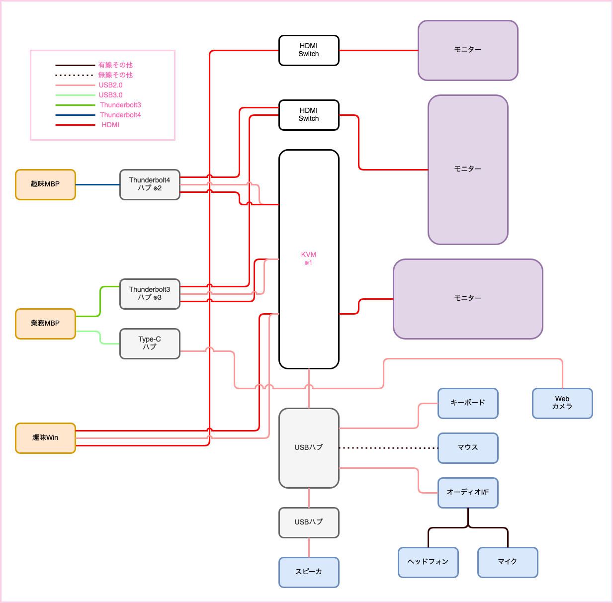

+++
author = "ttak0422"
title = "リモートワーク１年目の在宅環境"
date = "2022-04-03"
categories = [
  "ガジェット"
]
tags = [
  "ガジェット",
  "環境構築"
]
+++

## 初めに

リモートワークの企業に入社して１年が経過しました。
在宅環境がある程度整ってきたので整理します。

## 構成

### 解説

KVMを主体とした構成です。そのため複数の環境を同じモニターやキーボードを使って操作することが可能です。
KVMはSwitchBot経由でAlexaで操作します。

### 使ってる製品 (相性問題がありそうなところ)

- ※1 KVM [TESmart HDMI KVM Switch 4x1](https://www.amazon.co.jp/gp/product/B07F7VPSK2/ref=ppx_yo_dt_b_search_asin_title?ie=UTF8&th=1)
- ※2 Thunderbolt3 ハブ [WAVLINK Thunderbolt 3 Mini Dock](https://www.amazon.co.jp/gp/product/B098PXQWJ4/ref=ppx_yo_dt_b_asin_title_o00_s00?ie=UTF8&psc=1)
- ※3 Thunderbolt4 ハブ [Anker PowerExpand 5-in-1](https://paypaymall.yahoo.co.jp/store/ankerdirect/item/A8398/)
- HDMIケーブル [Anker Ultra High Speed HDMI](https://www.amazon.co.jp/gp/product/B08N5VG7WC/ref=ppx_yo_dt_b_search_asin_title?ie=UTF8&psc=1)
- Thunderboltケーブル [Anker Thunderbolt4 0.7m](https://paypaymall.yahoo.co.jp/store/ankerdirect/item/A8859/)
- Type-C to HDMIケーブル [Uni TypeC/HDMI](https://www.amazon.co.jp/gp/product/B0816DTXPK/ref=ppx_yo_dt_b_search_asin_title?ie=UTF8&psc=1)
- モニター1 [LG 32UP550-W](https://www.lg.com/jp/monitor/lg-32up550-w)
- モニター2 [Dell S3221QS](https://www.dell.com/ja-jp/shop/dell-s3221qs-315%E3%82%A4%E3%83%B3%E3%83%81%E3%83%AF%E3%82%A4%E3%83%89%E3%83%A2%E3%83%8B%E3%82%BF%E3%83%BC4k-%E6%9B%B2%E9%9D%A2-%E9%9D%9E%E5%85%89%E6%B2%A2-hdr-hdmix2dp-%E9%AB%98%E3%81%95%E8%AA%BF%E6%95%B4-%E3%82%B9%E3%83%94%E3%83%BC%E3%82%AB%E3%83%BC-freesync/apd/210-axhq/%E3%83%A2%E3%83%8B%E3%82%BF%E3%83%BC-%E3%83%A2%E3%83%8B%E3%82%BF%E3%83%BC%E3%82%A2%E3%82%AF%E3%82%BB%E3%82%B5%E3%83%AA%E3%83%BC)

### 解決出来なかったこと

#### MBPとモニターの相性問題

intel・m1のMBP共にLG・Dellのモニターでチラつきが発生します。配線の組み合わせを変えたりしているものの未解決。

#### Thunderbolt3ハブの選定
4K 60Hz * 2に対応しているThunderbolt3ケーブルが0.7m以上 or 自由なケーブルが選択可能なハブを見つけられなかった。
Thunderbolt3の延長ケーブルを試すものの断念。ハード的な制約を感じる...

### 今後の予定

#### 配線を綺麗にすること

どこかで...

#### ネット関連

どこかで...

## 最後に

Thunderbolt3でかなり悩んだので、Thunderbolt4の可能性に関心してますー。
